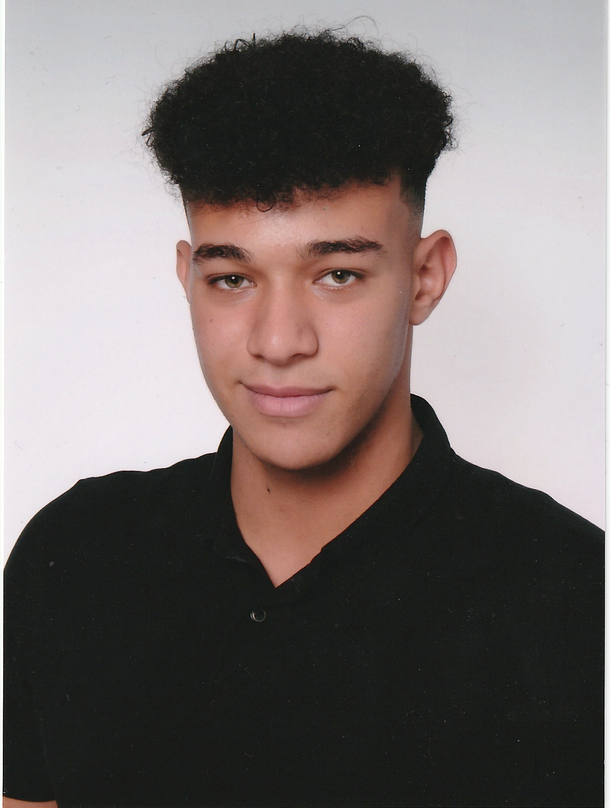

:toc: left

= EcoPoints

== Team

.Team
|===
|Name |Foto

|Abdullah Aldesoky
| 

|Oliver Daxinger
|

|Laurent Mali
|

|Linus Nestler
|

|Armin Salkovic
|

|===

== Description

We want to reward eco-friendly drivers by tracking their driving data
and calculate eco-points. Its like a game, the drivers get ranked by their points and
can compare to each other.

// == Minimum Viable Product
//
// Eine App die auf Android läuft und die Maximale Beschleunigung ausliest und anzeigt
//
//
//
// Unter den autofahrern ein ranking das man umweltfreundlicher faährt
// Verbrennungsmotor auto fahrer umweltfreundlicher fahren
// Österreichische fahrer mit verbrennungsmotor auto
//
// Weniger co2 ausstoß
// Ergebniss ranking
//
// Feedback (app)
// Gamifacation
// Vergleichsplatform
// Verhaltensänderung bei autofahrern herbeigerufen wird.
// Weleche sensoren hat so ein handy?
// Aufgrund dieser ein Modell entwickeln
// FahrverhaltenVergleichsplatform
//
// Int

== Diagrams

.Class-Diagramm
image::http://www.plantuml.com/plantuml/proxy?cache=no&src=https://raw.githubusercontent.com/2324-4bhif-syp/2324-4bhif-syp-project-ecopoints/main/asciidocs/plantuml/cld.puml[]

.Use-Case-Diagramm
image::http://www.plantuml.com/plantuml/proxy?cache=no&src=https://raw.githubusercontent.com/2324-4bhif-syp/2324-4bhif-syp-project-ecopoints/main/asciidocs/plantuml/ucd.puml[]

== Sprint-backlog

https://vm81.htl-leonding.ac.at/agiles/99-375/current[Sprint-backlog]

== How to start
=== backend quarkus application

1. Navigate to the backend folder

 ...cd backend/

2. Start the quarkus application

    ./mvnw clean quarkus:dev

3. To run the tests for the application

    ./mvnw test